# Capacitors

Symbol|Description
---|---
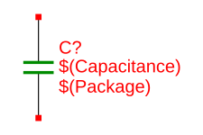|Capacitor
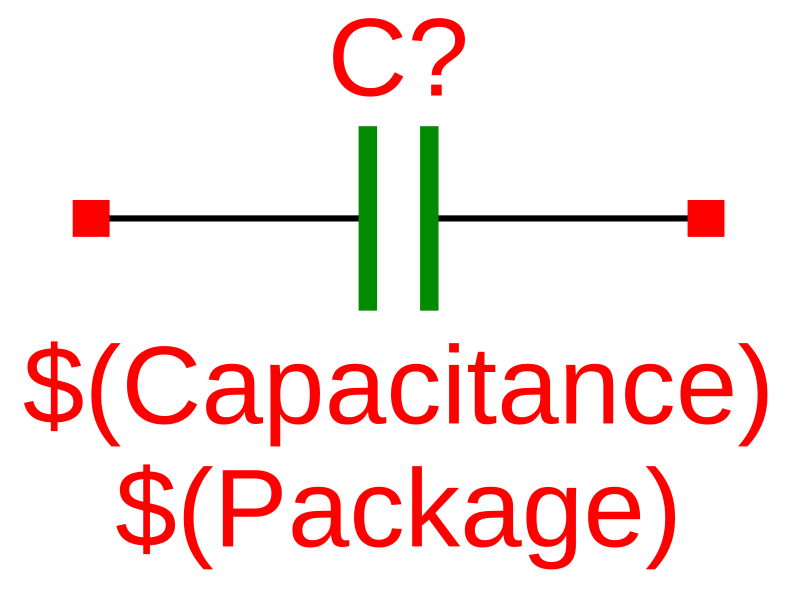|Capacitor
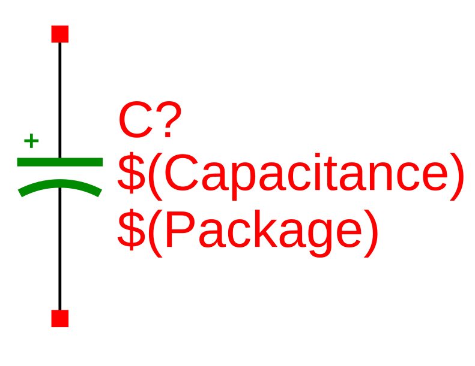|Capacitor
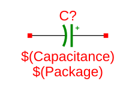|Capacitor

# Crystals

Symbol|Description
---|---
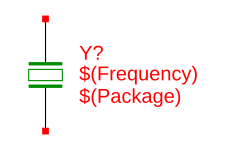|Crystal
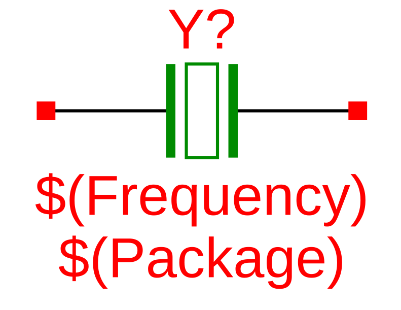|Crystal

# Diodes

Symbol|Description
---|---
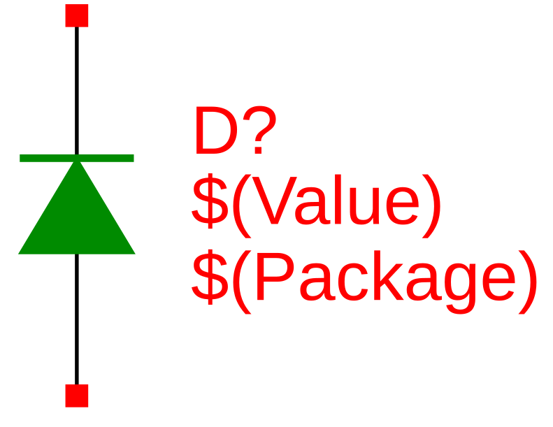|Diode
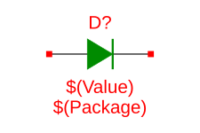|Diode
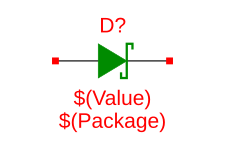|Diode
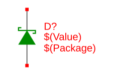|Diode
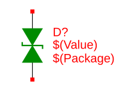|Diode
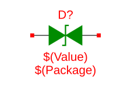|Diode
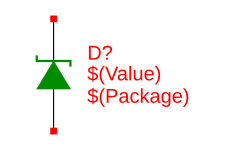|Diode
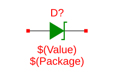|Diode

# Inductors

Symbol|Description
---|---
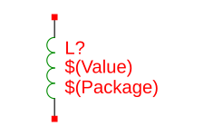|Inductor
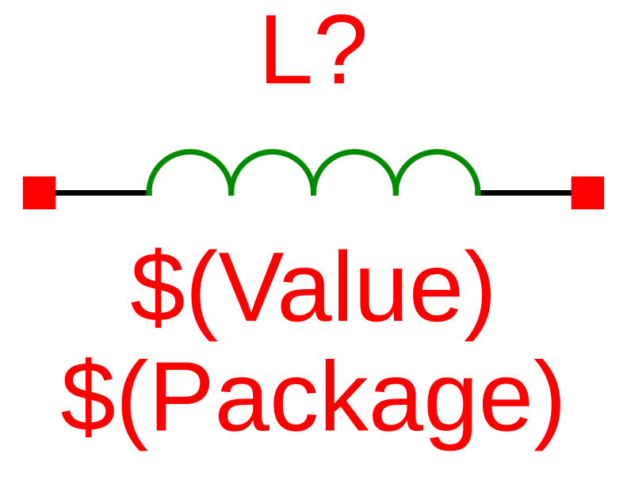|Inductor

# Resistors

Symbol|Description
---|---
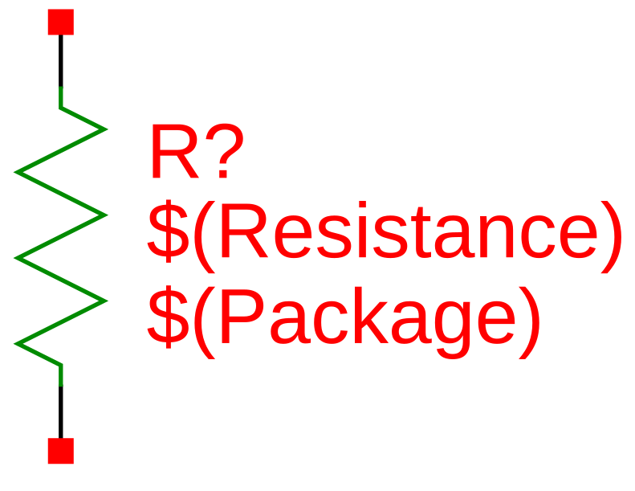|Resistor
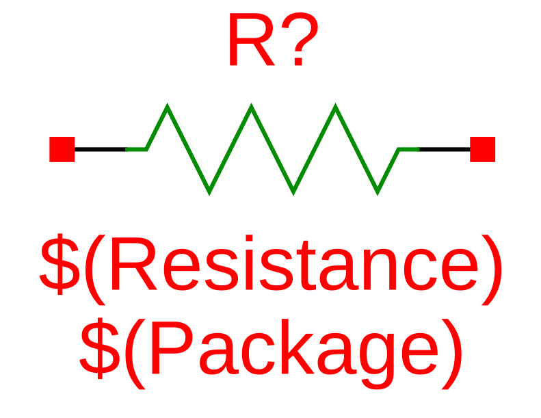|Resistor
